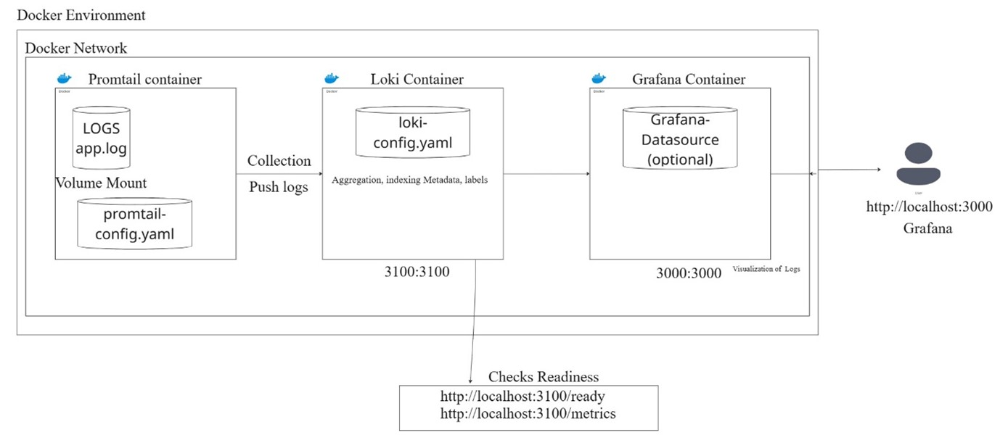

# Grafana Loki Monitoring Stack with Docker

This repository contains a Docker Compose setup for a full **Grafana Loki monitoring stack** including **Loki**, **Promtail**, and **Grafana**. This setup allows you to collect, store, and visualize logs from your applications or system.

---

## Table of Contents

* [Architecture Diagram](#architecture-diagram)
* [Services](#services)
* [Prerequisites](#prerequisites)
* [Setup Instructions](#setup-instructions)
* [Configuration](#configuration)
* [Accessing Grafana](#accessing-grafana)
* [Loki Health Checks](#loki-health-checks)
* [Volumes and Persistence](#volumes-and-persistence)
* [Network](#network)

---

## Architecture Diagram


*Replace `diagram.png` with your actual diagram file.*

**Explanation:**

* **Promtail**: Collects logs from local files and sends them to Loki.
* **Loki**: Stores logs in a highly efficient and queryable format.
* **Grafana**: Visualizes logs and metrics from Loki.

---

## Services

1. **Loki**

   * Image: `grafana/loki:latest`
   * Exposed Port: `3100`
   * Config file: `loki-config.yml`
   * Restart policy: `always`

2. **Promtail**

   * Image: `grafana/promtail:latest`
   * Monitors logs from `./logs` directory
   * Config file: `promtail-config.yml`
   * Restart policy: `always`

3. **Grafana**

   * Image: `grafana/grafana:latest`
   * Exposed Port: `3000`
   * Admin User: `admin`
   * Admin Password: `admin`
   * Persisted data in Docker volume `grafana-data`
   * Depends on Loki service

---

## Prerequisites

* Docker installed on your system
* Docker Compose (v1.27+ recommended)

---

## Setup Instructions

1. Clone the repository:

   ```bash
   git clone <repository-url>
   cd <repository-folder>
   ```

2. Place your log files inside the `logs` directory.

3. Ensure your `loki-config.yml` and `promtail-config.yml` are correctly configured.

4. Start the monitoring stack:

   ```bash
   docker-compose up -d
   or 
   docker-compose -f docker-compose.yaml up -d
   
   ```

5. Check running containers:

   ```bash
   docker ps
   ```

---

## Configuration

* **Loki Config:**
  Located at `./loki-config.yml`. Customize storage, schema, and scrape settings here.

* **Promtail Config:**
  Located at `./promtail-config.yml`. Customize file paths, labels, and Loki endpoint.

* **Grafana:**
  Admin credentials set via environment variables. You can add dashboards and panels after logging in.

---

## Accessing Grafana

Open your browser and visit:

```
http://localhost:3000
```

Login with:

* Username: `admin`
* Password: `admin`

---

## Loki Health Checks

Loki provides endpoints to check its readiness and metrics:

* **Readiness Check:**

  ```
  http://localhost:3100/ready
  ```

  Returns `200 OK` when Loki is ready to receive logs.

* **Metrics Endpoint:**

  ```
  http://localhost:3100/metrics
  ```

  Exposes Prometheus-compatible metrics for monitoring Loki performance.

---

## Volumes and Persistence

* **Grafana Data:** `grafana-data` volume is used to persist dashboards, users, and settings.
* Loki uses local configuration file but can be configured for persistent storage.

---

## Network

All services are connected to a custom Docker network called `monitoring` for secure internal communication.

---

